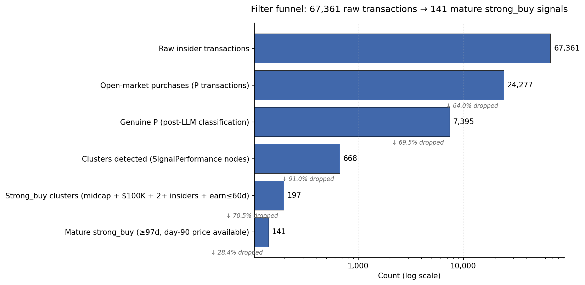
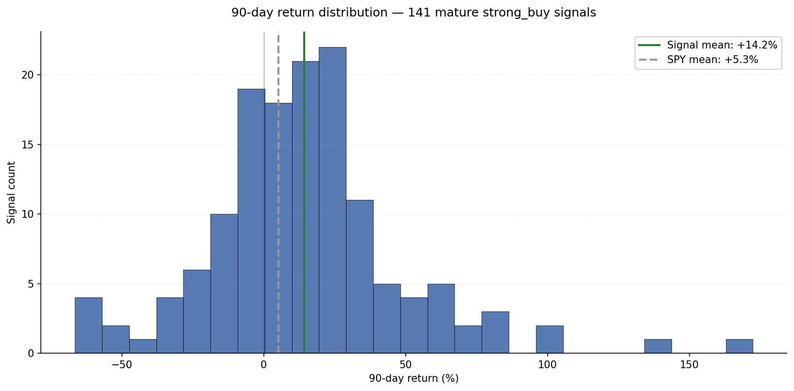
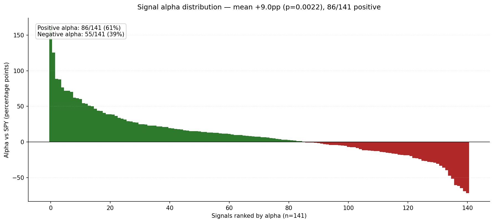

# LookInsight — Insider Conviction Signals
## A Methodology and Performance Brief

| | |
|---|---|
| **Snapshot date** | April 19, 2026 |
| **Cohort size** | 141 mature strong_buy signals |
| **Universe** | US-listed equities via SEC EDGAR Form 4 |
| **Delivery scope** | Institutional — quantitative hedge fund research desks |
| **Author** | Manohar |
| **Contact** | [manohar@lookinsight.ai](mailto:manohar@lookinsight.ai) |
| **More info** | [ci.lookinsight.ai](https://ci.lookinsight.ai) |

*Prepared for institutional review. Not for public distribution or retail resale.*

---

## 1. Executive Summary

LookInsight produces a filtered alternative-data feed of high-conviction insider-buying signals. This brief documents the methodology that compresses ~67,000 raw SEC Form 4 transactions down to 141 mature, high-quality signal clusters — and presents the performance evidence on that cohort.

**Headline results (cohort of 141 mature strong_buy signals):**

| Metric | Value | 95% Confidence Interval | p-value |
|---|---|---|---|
| Hit rate (90-day return > 0) | 67.4% | [59.3%, 74.6%] (Wilson) | <0.001 vs 50% null |
| Mean alpha vs SPY (90d) | +9.0 pp | [+3.3, +14.6] pp (t-dist) | 0.0022 |
| Mean 90-day return | +14.2% | — | — |
| Mean 90-day SPY return | +5.3% | — | — |
| Positive-alpha signals | 86 / 141 | — | — |

**The thesis in one sentence:** raw SEC Form 4 filings are ~99% noise, and the filter is the product. LookInsight's methodology funnel compresses ~67,000 insider transactions into 141 high-conviction clusters, and that compression is where the measured alpha lives.

**What this brief is not.** This is a signal-quality brief, not a portfolio backtest. Strategy statistics — Sharpe ratio, drawdown, turnover, capacity, hold-period sensitivity — depend on the construction framework a desk chooses and are deliberately left to the buyer. LookInsight delivers the signal; the desk benchmarks the strategy built on it.

Section 3 walks through the funnel. Section 4 explains each filter rule. Section 5 presents the performance evidence and breakdowns. Section 6 sets out the academic foundation. Section 7 indexes the supporting files and glossary.

---

## 2. Thesis

Insider behavior — specifically, open-market purchases by officers and directors — is a well-documented alpha source. Three decades of peer-reviewed research (see Section 6) establish the signal's foundation. The open question for a hedge fund research desk is not *whether* insider purchases predict returns, but *how to extract them at production scale* without being buried by the noise of RSU vesting, 10b5-1 execution, option mechanics, and structured placements.

**LookInsight's position.** Insider behavior alone — pure signal, no cross-filing overlays, no alternative-data fusion, no macro factors — produces statistically significant alpha over SPY when the right filters are applied to SEC Form 4 at scale. This brief documents the filters, the performance, and the audit path an analyst can follow to verify every row.

**What this saves a research desk.** Months of SEC filing parsing, transaction-type classification, LLM-based disambiguation of genuine open-market purchases from placements, historical market cap estimation, earnings-proximity gating, maturity accounting, and statistical validation — compressed into a 33-column data appendix consumable directly in research workflows.

---

## 3. The Funnel

**Insider signals are noise by default. The product is the filter.**

Across 22 months of SEC Form 4 ingestion, LookInsight's pipeline compresses **67,361 raw transactions** into **141 mature strong_buy signals**.

**Stage-by-stage:**

1. **Raw insider transactions (67,361).** All Form 4 line items ingested: purchases, sells, option exercises, gifts, derivative events, everything.
2. **Open-market purchases (24,277).** Filter to `transaction_code = 'P'`. Drops option exercises (M, C, W), sells (S, F, G, D), gifts, and derivative events. **64% drop.**
3. **Genuine P transactions (7,395).** An LLM-based classifier (Claude Haiku 4.5 plus a 21-rule prefilter) removes structured placements, RSU vestings reported as P, director option grants, employee stock-purchase programs, and 5+ buyers at identical price (typical IPO allocations and private placements). **70% drop.**
4. **Clusters detected (668).** Trades grouped into rolling-window clusters by issuer, deduplicated across multi-entity filings, and aggregated by distinct insider name. This is the full SignalPerformance node space — all directions, all conviction tiers, all maturity states. **91% drop** — the single largest compression step.
5. **Strong_buy clusters (197).** Apply cohort constraints: direction = buy, ≥2 distinct insiders, ≥$100K aggregate cluster value, historical market cap in the $300M–$5B midcap band, earnings proximity ≤60 days. **71% drop.**
6. **Mature strong_buy (141).** Restrict to signals ≥97 days old with an observed day-90 closing price. **28% drop** — remaining signals are recent filings still within the maturity window.

**Compression ratio:** roughly 477 raw transactions yield 1 mature strong_buy signal. The filter discards **99.8%** of raw input.

---

## 4. Methodology

Each filter in the funnel exists for a specific, evidence-backed reason. This section walks through them.

### 4.1 Why P transactions only

Of the thirteen SEC transaction codes, only `P` (open-market purchase) is retained. Sells (`S`), forced sells (`F`), option exercises (`M`, `C`, `W`), and gifts (`G`, `D`) are excluded because they carry substantial non-conviction motivation: tax withholding, diversification, scheduled 10b5-1 execution, or derivative mechanics unrelated to a directional view. Buying conviction is cleaner.

This asymmetry is the central empirical finding of **Jeng, Metrick & Zeckhauser (2003, *Review of Financial Studies*)**: insider purchases produce approximately 11% in abnormal annual returns, while insider sales show no comparable predictive power. **Cohen, Malloy & Pomorski (2012, *Journal of Finance*, "Decoding Inside Information")** further isolate *opportunistic* open-market purchases — trades that do not follow a regular annual pattern — as the high-signal subset, reinforcing the filter to genuine P and the engineering work of stripping out scheduled / routine purchases. Internal performance testing confirmed that aggregating across all bullish transaction codes diluted hit rate without meaningfully improving breadth.

### 4.2 Why 2+ distinct insiders

Single-insider buying is a high false-positive regime. A lone director putting $100K on the tape may be signaling, hedging a personal position, or complying with an implicit officer share-ownership guideline. Two or more distinct insiders buying within a rolling window demonstrate shared conviction — the probability that two officers independently reach the same bullish view without real information is low. This is the anchor of the cluster construct.

Classical insider-alpha studies are single-insider by default (**Lakonishok & Lee 2001**; **Jeng, Metrick & Zeckhauser 2003**), which understates the signal strength available from clustered trading. The multi-insider extension treats distinct-insider consensus as the dispositive filter — an engineering refinement on top of the academic baseline, consistent with the broader behavioral-consensus literature that correlated trades carry more informational content than solitary ones.

### 4.3 Why $100K+ cluster value

Below this threshold, cluster dollars are dominated by token show-of-faith trades rather than meaningful capital commitment. The threshold selects for insiders putting enough of their own capital on the line that the trade carries economic weight.

**Seyhun (1986, *Journal of Financial Economics*, "Insiders' profits, costs of trading, and market efficiency")** documented that larger-dollar insider trades carry disproportionately greater informational content, establishing the academic basis for applying a cluster-value floor. The $100K threshold is calibrated to midcap share prices and typical insider position sizes — low enough to retain breadth, high enough to discard token trades.

### 4.4 Why midcap $300M – $5B

The size effect in insider-purchase alpha is well-documented. **Lakonishok & Lee (2001, *Review of Financial Studies*)** found abnormal returns following insider purchases to be substantially stronger in smaller firms, and **Jeng, Metrick & Zeckhauser (2003)** replicated this size tilt in their return estimation. The academic baseline supports a small-to-mid-cap focus.

Our implementation sharpens the band empirically: the $5B–$10B bucket produced a hit rate of 38.1% versus 67.4% for issuers under $5B (p = 0.018 — confidence intervals do not overlap). The upper cap was therefore tightened from $10B to $5B. The $300M floor excludes microcaps where single-trade price manipulation risk is higher and liquidity is thinner for systematic execution.

**A note on in-sample calibration.** The $5B cap is the one filter parameter empirically tuned on the current data window; every other filter — P-only, 2+ distinct insiders, $100K cluster-value floor, ≤60-day earnings proximity, filing-date return anchor — is pre-specified from the cited literature rather than selected in-sample. A desk evaluating the forward profile of this cohort should expect hit rate to settle in the low-60s rather than the in-sample 67.4%, consistent with a modest shrinkage on the one parameter we fit. Even under that shrinkage, the alpha case remains literature-backed and statistically significant.

### 4.5 Why earnings proximity ≤ 60 days

Clusters formed within 60 days of the issuer's next earnings release produce significantly better results (p = 0.003 on this single rule alone). This is an information-asymmetry window: insiders likely have forward visibility on revenue, margin, or guidance that the market has not priced yet.

**Ke, Huddart & Petroni (2003, *Journal of Accounting and Economics*, "What insiders know about future earnings and how they use it: Evidence from insider trades")** showed that insider trades cluster in advance of material earnings outcomes, and that the predictive content is concentrated in the months leading up to announcement — the 60-day window is designed to capture this channel. Stacking multiple weak rules on top of this one cost signals for less than one percentage point of hit-rate improvement during empirical testing, so the methodology retains a single, evidence-based temporal rule.

### 4.6 Why filing-date returns (not transaction-date returns)

Returns are anchored to the **filing date**, not the transaction date. The 1–3 day gap between trading and SEC filing is invisible to an external reader — measuring returns from the transaction date embeds a look-ahead bias. Filing date is the earliest moment a third party could observe and act on the signal, and is therefore the only defensible anchor for alpha claims.

The filing-date anchor is the methodological convention in the return-estimation literature (**Lakonishok & Lee 2001**; subsequent work including **Cohen, Malloy & Pomorski 2012** frame their analysis around observable filing events rather than unobserved transaction dates). Using transaction date inflates the measured return by the size of the market's move during the reporting gap — a one-to-three-day phantom alpha that does not exist for a trader acting on the public filing.

### 4.7 What we tested and rejected

The following hypotheses were evaluated during methodology development and not promoted into the production filter set:

- **Single-insider dominance as a primary filter** (>70% of cluster value attributable to one insider). Directional evidence only; did not reach statistical significance on a representative sample.
- **Conviction tiers as hard exclusions.** The separation between tiers was directional (p = 0.11) but not robust enough to justify dropping signals. Retained as metadata.
- **Hostile activist exclusion as a hard filter.** 88% of a small losing subset carried hostile-activist overlap, but absolute sample size was insufficient to justify a binary filter. Retained as an informational flag (see Section 5.6).
- **Alternative alpha sources** (legislative trading feeds, corporate-action metadata combinations, network-topology features over insider relationships). Each either underperformed insider clusters on measured predictive value or carried reporting-lag constraints incompatible with systematic trading.

---

## 5. Performance

All results are for the 141-signal mature strong_buy cohort. Returns are computed from the filing date, 90 calendar days forward.

### 5.1 Headline metrics

| Metric | Value | 95% CI | p-value |
|---|---|---|---|
| Hit rate | 67.4% | [59.3%, 74.6%] | <0.001 |
| Mean alpha vs SPY | +9.0 pp | [+3.3, +14.6] | 0.0022 |
| Mean 90-day return | +14.2% | — | — |
| Median 90-day return | +11.4% | — | — |
| Mean SPY 90-day return | +5.3% | — | — |
| Positive alpha | 86 / 141 | — | — |
| Positive raw return | 95 / 141 | — | — |

Hit-rate CI is computed via the Wilson score interval; alpha CI via the t-distribution on the sample mean. p-values are two-sided (exact binomial test against 0.5 for hit rate, one-sample t-test against 0 for alpha).

### 5.2 Return distribution

The distribution has a long right tail — a handful of signals deliver returns above +50%. The signal-mean line sits approximately 9 percentage points above the SPY-mean line for the same 90-day windows. The mass on the positive side of zero reflects the 67% hit rate.

### 5.3 Signal-level alpha

Ranking each signal by its 90-day alpha makes the distribution explicit: 86 of 141 signals (61%) produce positive alpha vs SPY, with the largest single signal above +140 percentage points and the largest negative outlier near −70. The cohort's mean alpha of +9.0 pp is not driven by a single extreme tail — the bulk of the positive-alpha mass sits between +5 and +40 pp. Note that hit rate (95/141 = 67%, based on raw return > 0) and positive-alpha count (86/141 = 61%) differ because SPY itself advanced during several signal windows; signals that tracked flat would have positive raw return but negative alpha.

### 5.4 Breakdown by number of insiders

| Insiders in cluster | n | Hit rate | Mean alpha (pp) |
|---|---|---|---|
| 2 | 78 | 65.4% | +8.2 |
| 3 | 26 | 73.1% | +9.4 |
| 4 | 21 | 76.2% | +8.3 |
| 5+ | 16 | 56.3% | +12.6 |

Two observations. First, hit rates in the 2-, 3-, and 4-insider buckets are all above 65%, which suggests the core cluster hypothesis is stable across cluster sizes rather than being driven by a particular size regime. Second, the 5+ bucket has a lower hit rate but higher mean alpha — the few wins in large clusters are disproportionately large.

The 16 signals in the 5+ bucket span 12 distinct SIC industry codes (biotech, pharma, paper, chemicals, insurance, real estate, retail, mining, services) and carry no hostile-activist overlap, so the lower hit rate is not concentration in a single failing theme. The higher mean alpha is carried by several outsized winners with individual alpha exceeding +70 pp. We expose the underlying cluster size in the `num_insiders` column; analysts optimizing for hit rate may choose to cap at 4 insiders, while those willing to trade hit rate for alpha magnitude can keep the full cohort.

### 5.5 High-conviction subset (`signal_level`)

The `signal_level` column in the data appendix splits the cohort into two conviction bands:

- **`high`** — clusters with 3+ distinct insiders, or with 2+ insiders carrying an officer-level majority and cluster value ≥ $200K. **77 signals.**
- **`medium`** — the remaining strong_buy signals (typically 2-insider clusters that do not meet the officer-majority threshold). **64 signals.**

| Signal level | n | Hit rate | Mean 90d return | Mean alpha (pp) |
|---|---|---|---|---|
| high | 77 | 68.8% | +15.1% | +9.8 |
| medium | 64 | 65.6% | +13.2% | +8.0 |

Both bands are alpha-positive. The `high` band is stronger across all three metrics. Desks building more concentrated strategies may filter to `signal_level = 'high'`; desks optimizing for breadth can use the full cohort. The column is exposed directly in the data appendix so either choice can be made independently.

### 5.6 Hostile activist overlap

The cohort includes 3 signals (2.1%) where the issuer had a contemporaneous Schedule 13D filing carrying hostile-activist language.

| Hostile flag | n | Hit rate | Mean alpha (pp) |
|---|---|---|---|
| False | 138 | 68.1% | +9.2 |
| True | 3 | 33.3% | −2.0 |

The hostile subset underperforms substantially (1 winner out of 3), directionally consistent with the earlier qualitative finding that hostile-activist overlap is a negative predictor. `hostile_flag` is exported as an informational column — it is optionality the analyst controls, not a claim from LookInsight.

### 5.7 Signal-level performance log

Signals are grouped below by filing month, most recent first. Each month header shows the aggregate count, hit rate, mean 90-day return, and mean alpha for that month; within the month, rows are individual signals sorted by filing date descending. `Conv` = `signal_level` (HIGH / MEDIUM); `#I` = distinct insiders in the cluster; † marks signals with a contemporaneous hostile Schedule 13D filing.

#### December 2025

_n = 18 · hit rate 72% · mean return +11.9% · mean alpha +12.7 pp_

| Filing Date | Ticker | Conv | #I | Entry | Exit | 90d Return | Alpha (pp) |
|---|---|---|---|---|---|---|---|
| 2025-12-22 | VSTS | HIGH | 4 | $7.14 | $7.72 | +8.1% | +12.2 |
| 2025-12-18 | ANDG | HIGH | 5 | $25.40 | $28.27 | +11.3% | +13.2 |
| 2025-12-18 | SEI | MEDIUM | 2 | $42.96 | $68.56 | +59.6% | +61.5 |
| 2025-12-16 | SMRT | MEDIUM | 2 | $2.05 | $1.72 | -16.1% | -14.9 |
| 2025-12-16 | RLMD | MEDIUM | 2 | $4.50 | $6.18 | +37.3% | +38.5 |
| 2025-12-16 | MLP | MEDIUM | 2 | $16.81 | $16.02 | -4.7% | -3.5 |
| 2025-12-12 | AARD | MEDIUM | 2 | $14.43 | $5.26 | -63.5% | -61.5 |
| 2025-12-12 | CE | HIGH | 2 | $43.48 | $59.60 | +37.1% | +39.1 |
| 2025-12-09 | MNR | MEDIUM | 2 | $11.74 | $13.26 | +12.9% | +13.3 |
| 2025-12-09 | ARX | HIGH | 6 | $15.37 | $10.94 | -28.8% | -28.4 |
| 2025-12-09 | MRVI | MEDIUM | 2 | $3.69 | $3.63 | -1.6% | -1.2 |
| 2025-12-08 | AEBI | HIGH | 3 | $12.36 | $13.50 | +9.2% | +9.7 |
| 2025-12-08 | XRN | HIGH | 2 | $31.91 | $35.52 | +11.3% | +11.8 |
| 2025-12-04 | MSBI | HIGH | 4 | $19.73 | $22.62 | +14.7% | +14.2 |
| 2025-12-03 | ANNX | MEDIUM | 2 | $4.28 | $5.43 | +26.9% | +27.1 |
| 2025-12-02 | ENR | MEDIUM | 2 | $16.80 | $20.50 | +22.0% | +21.0 |
| 2025-12-01 | HLF | MEDIUM | 2 | $12.63 | $19.24 | +52.3% | +51.1 |
| 2025-12-01 | ADTN | HIGH | 3 | $7.91 | $9.96 | +25.9% | +24.7 |

#### November 2025

_n = 17 · hit rate 59% · mean return +1.2% · mean alpha -1.3 pp_

| Filing Date | Ticker | Conv | #I | Entry | Exit | 90d Return | Alpha (pp) |
|---|---|---|---|---|---|---|---|
| 2025-11-28 | RPD | HIGH | 4 | $15.68 | $6.39 | -59.2% | -60.4 |
| 2025-11-26 | CRSR | MEDIUM | 2 | $6.14 | $5.45 | -11.2% | -12.7 |
| 2025-11-25 | EVLV | HIGH | 4 | $6.20 | $4.90 | -21.0% | -22.4 |
| 2025-11-24 | BBWI | HIGH | 5 | $15.43 | $22.52 | +46.0% | +43.6 |
| 2025-11-24 | JACK† | MEDIUM | 2 | $17.36 | $17.07 | -1.7% | -4.0 |
| 2025-11-24 | RXO | HIGH | 3 | $12.16 | $14.66 | +20.6% | +18.2 |
| 2025-11-21 | GLRE | HIGH | 3 | $13.00 | $13.97 | +7.5% | +3.3 |
| 2025-11-20 | CNS | MEDIUM | 2 | $58.86 | $65.38 | +11.1% | +5.6 |
| 2025-11-14 | FRPH | HIGH | 3 | $24.55 | $23.69 | -3.5% | -5.2 |
| 2025-11-13 | ITGR | HIGH | 4 | $68.05 | $87.18 | +28.1% | +24.8 |
| 2025-11-13 | CLVT | MEDIUM | 2 | $3.50 | $1.81 | -48.3% | -51.6 |
| 2025-11-12 | FRSH | HIGH | 2 | $11.64 | $8.73 | -25.0% | -26.6 |
| 2025-11-10 | WWW | HIGH | 3 | $16.15 | $18.09 | +12.0% | +9.9 |
| 2025-11-10 | UTZ | HIGH | 4 | $9.85 | $10.86 | +10.2% | +8.1 |
| 2025-11-06 | BBT | HIGH | 4 | $25.63 | $30.20 | +17.8% | +15.2 |
| 2025-11-04 | OBK | HIGH | 6 | $34.30 | $44.03 | +28.4% | +25.1 |
| 2025-11-03 | IRDM | MEDIUM | 2 | $18.04 | $19.65 | +8.9% | +6.8 |

#### October 2025

_n = 2 · hit rate 0% · mean return -10.4% · mean alpha -11.9 pp_

| Filing Date | Ticker | Conv | #I | Entry | Exit | 90d Return | Alpha (pp) |
|---|---|---|---|---|---|---|---|
| 2025-10-28 | ASIC | MEDIUM | 2 | $18.96 | $17.78 | -6.2% | -7.3 |
| 2025-10-22 | ANGO | HIGH | 3 | $12.14 | $10.36 | -14.7% | -16.4 |

#### September 2025

_n = 6 · hit rate 83% · mean return +14.4% · mean alpha +10.1 pp_

| Filing Date | Ticker | Conv | #I | Entry | Exit | 90d Return | Alpha (pp) |
|---|---|---|---|---|---|---|---|
| 2025-09-30 | PGEN | HIGH | 4 | $3.29 | $4.45 | +35.3% | +31.7 |
| 2025-09-16 | ZVRA | HIGH | 3 | $7.26 | $8.17 | +12.5% | +9.1 |
| 2025-09-15 | RAPP | HIGH | 3 | $24.73 | $29.60 | +19.7% | +16.4 |
| 2025-09-15 | TTGT | MEDIUM | 2 | $6.08 | $5.20 | -14.5% | -17.8 |
| 2025-09-04 | SBH | HIGH | 4 | $14.13 | $15.39 | +8.9% | +3.3 |
| 2025-09-02 | FTRE | MEDIUM | 2 | $10.01 | $12.44 | +24.3% | +17.7 |

#### August 2025

_n = 15 · hit rate 60% · mean return +7.2% · mean alpha +0.4 pp_

| Filing Date | Ticker | Conv | #I | Entry | Exit | 90d Return | Alpha (pp) |
|---|---|---|---|---|---|---|---|
| 2025-08-27 | ICUI | MEDIUM | 2 | $126.62 | $151.90 | +20.0% | +15.3 |
| 2025-08-19 | PLMR | MEDIUM | 2 | $120.86 | $128.48 | +6.3% | +2.0 |
| 2025-08-15 | KRO | HIGH | 6 | $5.84 | $4.72 | -19.2% | -23.9 |
| 2025-08-14 | AAOI | HIGH | 3 | $21.01 | $23.94 | +13.9% | +7.7 |
| 2025-08-14 | ESTA | MEDIUM | 2 | $37.95 | $63.19 | +66.5% | +60.3 |
| 2025-08-13 | PRGS | HIGH | 3 | $46.11 | $43.09 | -6.5% | -12.8 |
| 2025-08-13 | TROX | HIGH | 6 | $3.66 | $3.45 | -5.7% | -11.9 |
| 2025-08-11 | TNDM | HIGH | 2 | $10.11 | $16.37 | +61.9% | +54.5 |
| 2025-08-11 | PTLO | HIGH | 4 | $7.85 | $4.73 | -39.8% | -47.2 |
| 2025-08-08 | AUB | MEDIUM | 2 | $31.39 | $31.70 | +1.0% | -4.5 |
| 2025-08-06 | BRBR | HIGH | 3 | $38.95 | $30.33 | -22.1% | -29.1 |
| 2025-08-06 | TFX | HIGH | 3 | $111.09 | $123.66 | +11.3% | +4.3 |
| 2025-08-05 | OI | HIGH | 3 | $13.00 | $11.76 | -9.5% | -18.7 |
| 2025-08-05 | PRLB | MEDIUM | 2 | $44.20 | $53.47 | +21.0% | +11.8 |
| 2025-08-01 | CNOB | MEDIUM | 2 | $21.77 | $23.58 | +8.3% | -1.3 |

#### July 2025

_n = 2 · hit rate 50% · mean return +63.5% · mean alpha +55.8 pp_

| Filing Date | Ticker | Conv | #I | Entry | Exit | 90d Return | Alpha (pp) |
|---|---|---|---|---|---|---|---|
| 2025-07-31 | TLRY | HIGH | 3 | $5.80 | $13.60 | +134.5% | +125.4 |
| 2025-07-16 | HELE | HIGH | 2 | $22.39 | $20.73 | -7.4% | -13.8 |

#### June 2025

_n = 10 · hit rate 90% · mean return +40.1% · mean alpha +31.1 pp_

| Filing Date | Ticker | Conv | #I | Entry | Exit | 90d Return | Alpha (pp) |
|---|---|---|---|---|---|---|---|
| 2025-06-26 | PVH | MEDIUM | 2 | $64.98 | $89.43 | +37.6% | +29.3 |
| 2025-06-24 | GIII | MEDIUM | 2 | $21.86 | $26.42 | +20.9% | +10.7 |
| 2025-06-23 | SVRA | MEDIUM | 2 | $2.16 | $3.49 | +61.6% | +50.1 |
| 2025-06-18 | NUVB | HIGH | 2 | $1.79 | $3.27 | +82.7% | +71.9 |
| 2025-06-10 | CALY | HIGH | 4 | $7.70 | $9.44 | +22.6% | +14.7 |
| 2025-06-06 | MATV | HIGH | 5 | $6.01 | $11.82 | +96.7% | +88.0 |
| 2025-06-05 | MAGN | HIGH | 7 | $13.04 | $11.61 | -11.0% | -19.8 |
| 2025-06-05 | IOVA | HIGH | 3 | $1.80 | $2.21 | +22.8% | +13.9 |
| 2025-06-04 | STGW | HIGH | 4 | $4.27 | $5.59 | +30.9% | +23.1 |
| 2025-06-04 | OFIX | MEDIUM | 2 | $10.90 | $14.89 | +36.6% | +28.9 |

#### May 2025

_n = 15 · hit rate 73% · mean return +24.0% · mean alpha +14.4 pp_

| Filing Date | Ticker | Conv | #I | Entry | Exit | 90d Return | Alpha (pp) |
|---|---|---|---|---|---|---|---|
| 2025-05-30 | INNV | MEDIUM | 2 | $4.09 | $3.83 | -6.4% | -16.8 |
| 2025-05-23 | VFC | MEDIUM | 2 | $11.73 | $12.82 | +9.3% | -0.8 |
| 2025-05-23 | PHAT | MEDIUM | 2 | $4.02 | $10.95 | +172.4% | +162.3 |
| 2025-05-19 | SNDX | HIGH | 3 | $9.30 | $15.87 | +70.7% | +62.2 |
| 2025-05-19 | NPKI | MEDIUM | 2 | $8.01 | $9.92 | +23.9% | +15.4 |
| 2025-05-19 | VYX | MEDIUM | 2 | $10.58 | $12.85 | +21.5% | +13.0 |
| 2025-05-15 | RPAY | HIGH | 2 | $3.84 | $5.70 | +48.4% | +38.9 |
| 2025-05-14 | BNL | MEDIUM | 2 | $14.77 | $15.87 | +7.5% | -2.2 |
| 2025-05-14 | ERII | MEDIUM | 2 | $12.31 | $14.30 | +16.2% | +6.5 |
| 2025-05-14 | AESI | MEDIUM | 2 | $12.72 | $11.58 | -9.0% | -18.7 |
| 2025-05-13 | THRM | HIGH | 3 | $28.32 | $32.69 | +15.4% | +6.8 |
| 2025-05-13 | PRG | MEDIUM | 2 | $28.28 | $31.80 | +12.4% | +3.8 |
| 2025-05-12 | COLD | HIGH | 2 | $16.63 | $13.56 | -18.5% | -27.9 |
| 2025-05-12 | NEOG | HIGH | 8 | $6.50 | $5.11 | -21.4% | -30.8 |
| 2025-05-05 | PDM | MEDIUM | 2 | $6.49 | $7.62 | +17.4% | +5.1 |

#### April 2025

_n = 6 · hit rate 83% · mean return +14.1% · mean alpha -3.7 pp_

| Filing Date | Ticker | Conv | #I | Entry | Exit | 90d Return | Alpha (pp) |
|---|---|---|---|---|---|---|---|
| 2025-04-25 | CFFN | HIGH | 3 | $5.37 | $5.97 | +11.2% | -4.4 |
| 2025-04-17 | CVGW | HIGH | 3 | $25.54 | $25.75 | +0.8% | -18.1 |
| 2025-04-15 | HUMA | HIGH | 5 | $1.54 | $2.47 | +60.4% | +43.8 |
| 2025-04-14 | REPX | MEDIUM | 2 | $22.60 | $26.08 | +15.4% | -0.8 |
| 2025-04-14 | RCKT | MEDIUM | 2 | $5.91 | $3.05 | -48.4% | -64.6 |
| 2025-04-07 | TITN | MEDIUM | 2 | $14.59 | $21.22 | +45.4% | +22.0 |

#### March 2025

_n = 23 · hit rate 65% · mean return +12.0% · mean alpha +5.4 pp_

| Filing Date | Ticker | Conv | #I | Entry | Exit | 90d Return | Alpha (pp) |
|---|---|---|---|---|---|---|---|
| 2025-03-31 | AAP | HIGH | 4 | $38.15 | $45.59 | +19.5% | +8.7 |
| 2025-03-21 | WBTN | MEDIUM | 2 | $8.73 | $8.36 | -4.2% | -9.9 |
| 2025-03-19 | CRGY† | MEDIUM | 2 | $11.16 | $9.24 | -17.2% | -22.9 |
| 2025-03-18 | NVRI | HIGH | 2 | $6.56 | $8.51 | +29.7% | +22.0 |
| 2025-03-17 | FNKO | MEDIUM | 2 | $7.19 | $5.07 | -29.5% | -36.1 |
| 2025-03-17 | DK | HIGH | 4 | $15.35 | $21.58 | +40.6% | +34.0 |
| 2025-03-17 | MAC | MEDIUM | 2 | $16.47 | $15.63 | -5.1% | -11.7 |
| 2025-03-17 | HRTG | MEDIUM | 2 | $12.79 | $23.41 | +83.0% | +76.5 |
| 2025-03-13 | NFE | HIGH | 2 | $8.51 | $3.20 | -62.4% | -71.8 |
| 2025-03-13 | NE | HIGH | 3 | $21.10 | $27.92 | +32.3% | +22.9 |
| 2025-03-11 | MFIC | MEDIUM | 2 | $11.00 | $11.59 | +5.4% | -2.8 |
| 2025-03-11 | STRA | HIGH | 4 | $77.69 | $83.61 | +7.6% | -0.6 |
| 2025-03-11 | AMRC | HIGH | 4 | $10.32 | $15.97 | +54.8% | +46.5 |
| 2025-03-11 | IE | HIGH | 2 | $5.71 | $8.27 | +44.8% | +36.6 |
| 2025-03-11 | UCTT | HIGH | 3 | $22.98 | $21.34 | -7.1% | -15.3 |
| 2025-03-10 | ACA | MEDIUM | 2 | $78.38 | $89.80 | +14.6% | +7.3 |
| 2025-03-10 | MITK | HIGH | 4 | $8.83 | $10.34 | +17.1% | +9.8 |
| 2025-03-10 | EVH | HIGH | 4 | $9.10 | $8.48 | -6.8% | -14.1 |
| 2025-03-06 | ECPG | HIGH | 3 | $35.84 | $38.29 | +6.8% | +2.5 |
| 2025-03-06 | JELD | MEDIUM | 2 | $5.92 | $3.83 | -35.3% | -39.7 |
| 2025-03-05 | TALK† | HIGH | 3 | $2.76 | $3.41 | +23.6% | +21.0 |
| 2025-03-05 | FTDR | MEDIUM | 2 | $42.05 | $56.84 | +35.2% | +32.6 |
| 2025-03-03 | TBLA | MEDIUM | 2 | $2.81 | $3.64 | +29.5% | +27.7 |

#### February 2025

_n = 6 · hit rate 33% · mean return +3.9% · mean alpha +5.1 pp_

| Filing Date | Ticker | Conv | #I | Entry | Exit | 90d Return | Alpha (pp) |
|---|---|---|---|---|---|---|---|
| 2025-02-28 | MBC | MEDIUM | 2 | $13.99 | $10.27 | -26.6% | -26.2 |
| 2025-02-27 | RCUS | MEDIUM | 2 | $9.88 | $9.13 | -7.6% | -8.3 |
| 2025-02-27 | PPTA | HIGH | 5 | $8.26 | $14.14 | +71.2% | +70.4 |
| 2025-02-25 | ECG | HIGH | 3 | $42.30 | $59.45 | +40.5% | +40.8 |
| 2025-02-19 | HP | HIGH | 3 | $24.61 | $15.63 | -36.5% | -33.5 |
| 2025-02-03 | ASH | HIGH | 2 | $58.70 | $48.22 | -17.9% | -12.4 |

#### December 2024

_n = 4 · hit rate 50% · mean return +10.6% · mean alpha +17.0 pp_

| Filing Date | Ticker | Conv | #I | Entry | Exit | 90d Return | Alpha (pp) |
|---|---|---|---|---|---|---|---|
| 2024-12-26 | PGNY | MEDIUM | 2 | $14.71 | $21.84 | +48.5% | +53.6 |
| 2024-12-17 | XPRO | MEDIUM | 2 | $11.09 | $10.59 | -4.5% | +1.3 |
| 2024-12-16 | HRZN | MEDIUM | 2 | $6.85 | $7.66 | +11.8% | +18.0 |
| 2024-12-11 | TCNNF | HIGH | 10 | $4.83 | $4.19 | -13.2% | -5.1 |

#### November 2024

_n = 1 · hit rate 100% · mean return +6.8% · mean alpha +7.3 pp_

| Filing Date | Ticker | Conv | #I | Entry | Exit | 90d Return | Alpha (pp) |
|---|---|---|---|---|---|---|---|
| 2024-11-27 | TCPC | MEDIUM | 2 | $7.16 | $7.65 | +6.8% | +7.3 |

#### September 2024

_n = 1 · hit rate 100% · mean return +101.2% · mean alpha +88.6 pp_

| Filing Date | Ticker | Conv | #I | Entry | Exit | 90d Return | Alpha (pp) |
|---|---|---|---|---|---|---|---|
| 2024-09-06 | UEC | MEDIUM | 2 | $4.26 | $8.57 | +101.2% | +88.6 |

#### August 2024

_n = 7 · hit rate 100% · mean return +27.6% · mean alpha +18.2 pp_

| Filing Date | Ticker | Conv | #I | Entry | Exit | 90d Return | Alpha (pp) |
|---|---|---|---|---|---|---|---|
| 2024-08-23 | ATEC | HIGH | 4 | $5.74 | $10.21 | +77.9% | +71.9 |
| 2024-08-22 | CSV | MEDIUM | 2 | $30.84 | $37.75 | +22.4% | +15.9 |
| 2024-08-16 | PCRX | HIGH | 5 | $12.94 | $16.37 | +26.5% | +19.1 |
| 2024-08-13 | NVST | HIGH | 2 | $16.99 | $20.75 | +22.1% | +11.3 |
| 2024-08-13 | EYE | MEDIUM | 2 | $10.61 | $11.82 | +11.4% | +0.6 |
| 2024-08-12 | GT | HIGH | 4 | $7.78 | $9.77 | +25.6% | +12.9 |
| 2024-08-07 | CTOS | HIGH | 2 | $4.05 | $4.35 | +7.4% | -4.1 |

#### June 2024

_n = 3 · hit rate 67% · mean return +1.9% · mean alpha -0.9 pp_

| Filing Date | Ticker | Conv | #I | Entry | Exit | 90d Return | Alpha (pp) |
|---|---|---|---|---|---|---|---|
| 2024-06-17 | BOC | HIGH | 7 | $13.90 | $14.74 | +6.0% | +2.8 |
| 2024-06-11 | ONDS | MEDIUM | 2 | $0.86 | $0.89 | +3.5% | +1.4 |
| 2024-06-07 | LEG | HIGH | 6 | $11.77 | $11.32 | -3.8% | -7.1 |

#### May 2024

_n = 5 · hit rate 40% · mean return -4.6% · mean alpha -9.2 pp_

| Filing Date | Ticker | Conv | #I | Entry | Exit | 90d Return | Alpha (pp) |
|---|---|---|---|---|---|---|---|
| 2024-05-30 | BCRX | HIGH | 9 | $6.57 | $8.55 | +30.1% | +23.0 |
| 2024-05-29 | PRVA | MEDIUM | 2 | $16.40 | $20.76 | +26.6% | +19.5 |
| 2024-05-16 | ASTE | MEDIUM | 2 | $32.81 | $31.42 | -4.2% | -7.4 |
| 2024-05-15 | DNA | MEDIUM | 2 | $33.56 | $11.24 | -66.5% | -69.2 |
| 2024-05-13 | CNMD | HIGH | 4 | $71.42 | $64.97 | -9.0% | -11.7 |

*† Signal with contemporaneous hostile Schedule 13D filing (3 of 141).*

The same data is exported in the CSV and Parquet appendix for programmatic ingestion — see Section 7 for the file index.

---

## 6. Academic Foundation

The insider open-market purchase signal is not novel. It rests on three decades of peer-reviewed research. LookInsight's contribution is not the thesis — the thesis has been published, tested, and replicated. LookInsight's contribution is the production-scale engineering that makes the thesis deliverable as a clean alpha signal for a systematic desk.

**Key references in the foundation:**

- **Lakonishok, J. & Lee, I. (2001)** — *"Are Insider Trades Informative?"* Review of Financial Studies, 14(1). Large-sample NYSE/AMEX/NASDAQ evidence of abnormal returns following insider purchases, stronger in smaller firms.
- **Jeng, L., Metrick, A. & Zeckhauser, R. (2003)** — *"Estimating the Returns to Insider Trading."* Review of Financial Studies, 16(2). Documented that insider purchases earn approximately 11% abnormal annual returns, with strong asymmetry between purchases and sells.
- **Cohen, L., Malloy, C. & Pomorski, L. (2012)** — *"Decoding Inside Information."* Journal of Finance, 67(3). Separated opportunistic from routine insider trading; opportunistic insider buys predict future returns far more strongly than routine trades — the academic anchor for filtering GENUINE P from scheduled P.
- **Brav, A., Jiang, W., Partnoy, F. & Thomas, R. (2008)** — *"Hedge Fund Activism, Corporate Governance, and Firm Performance."* Journal of Finance, 63(4). Return dynamics around Schedule 13D filings — the foundation for the activist overlay exposed via `hostile_flag`.

**What the academic literature leaves to an implementer:**

- **Structured classification of Form 4 transactions.** Not every `P` code is a genuine conviction purchase. Removing structured placements, employee stock-purchase programs, option-related P codes, and multi-entity duplication is a prerequisite that the literature assumes, not performs.
- **Temporal clustering across multiple insiders.** Canonical insider-alpha studies are single-insider by default. Extending to multi-insider clusters with rolling windows, shared-name aggregation, and cluster-value aggregation is an engineering construction that does not exist off the shelf.
- **Historical market cap estimation and size-filtered cohorts.** Required to reproduce the midcap cut that our own data confirms as the strongest band.
- **Filing-date anchoring.** The literature often measures returns from transaction date. Filing-date anchoring eliminates look-ahead bias and matches what a third party could actually trade — a small but load-bearing distinction.
- **Production-scale maturity bookkeeping and survivorship-aware return attribution.**

Each of those steps is months of data engineering per team. LookInsight has productionized them, exposed the output in the 33-column data appendix, and documented the methodology in this brief. A quantitative desk evaluating LookInsight is not being asked to validate the underlying thesis — the thesis is literature. The desk is being asked to verify that the engineering faithfully translates that literature into actionable signals — and the data appendix (every row tied to its SEC EDGAR filing URL) makes that verification a one-click exercise.

---

## 7. Appendix

### File index

| File | Purpose |
|---|---|
| `signals_v1_1_2026-04-19.csv` | 141-row signal export with 33-column schema (every row carries its SEC EDGAR filing URL) |
| `signals_v1_1_2026-04-19.parquet` | Same data, typed Parquet for pandas/polars/Spark |
| `DATA_DICTIONARY.md` | Authoritative column specification and derivation formulas |
| `brief_v1_1.md` | This document |
| `stats.json` | Machine-readable version of every number cited in this brief |
| `charts/funnel.png` | Filter funnel visualization |
| `charts/return_distribution.png` | 90-day return histogram |
| `charts/alpha_waterfall.png` | Signal alpha distribution |

### Glossary

- **Strong_buy:** the cohort definition — a cluster satisfying all of: direction = buy, ≥2 insiders, ≥$100K total value, midcap market cap, earnings proximity ≤ 60 days.
- **Conviction tier:** classification of a cluster's strength (strong_buy, buy, watch). This brief covers only strong_buy.
- **Wilson CI:** a confidence interval for a binomial proportion that has better small-sample coverage than the normal-approximation interval.
- **Alpha (90d):** a signal's 90-day return minus the SPY 90-day return over the same calendar window, expressed in percentage points.
- **Hostile flag:** true if the issuer had a contemporaneous Schedule 13D filing containing hostile-activist language. Informational only — not a cohort filter.
- **Filing-date return:** return measured starting from the close on the SEC filing date, not the underlying transaction date. Avoids look-ahead bias.

---

*LookInsight research brief. Cohort: 141 mature strong_buy signals. Snapshot: April 19, 2026.*
*Manohar · [manohar@lookinsight.ai](mailto:manohar@lookinsight.ai) · [ci.lookinsight.ai](https://ci.lookinsight.ai)*
*Prepared for institutional review.*
